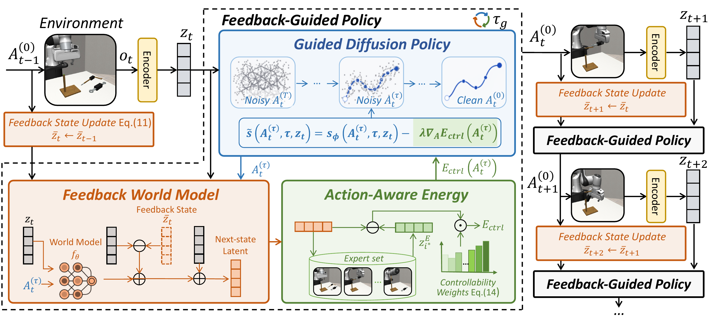

<h1 align="center">Feedback World Model Enables Precise Guidance of Diffusion Policy</h1>

  
  
  
  

  <a href="https://morpheus-an.github.io/"><strong>Tuo An</strong></a>1,* &nbsp;&nbsp;
  <a href="https://jiajindou.github.io/"><strong>Jindou Jia</strong></a>1,* &nbsp;&nbsp;
  <a href="https://reagan1311.github.io/"><strong>Gen Li</strong></a>1 &nbsp;&nbsp;
  <a href="https://lorenzo-0-0.github.io/"><strong>Jingliang Li</strong></a>1 &nbsp;&nbsp;
  <a href="https://chuhaozhou99.github.io/Chuhao-Zhou/"><strong>Chuhao Zhou</strong></a>1
   
  <strong>Pengfei Liu</strong>1 &nbsp;&nbsp;
  <strong>Bofan Lyu</strong>1 &nbsp;&nbsp;
  <strong>Jiaqi Bai</strong>1 &nbsp;&nbsp;
  <a href="https://scholar.google.com/citations?hl=en&user=KWXEabIAAAAJ&view_op=list_works&sortby=pubdate"><strong>Xinying Guo</strong></a>1 &nbsp;&nbsp;
  <a href="https://scholar.google.com/citations?user=SZg1xeoAAAAJ&hl=zh-CN"><strong>Geng Li</strong></a>1 &nbsp;&nbsp;
  <a href="https://marsyang.site/"><strong>Jianfei Yang</strong></a>1,†

  1MARS Lab, Nanyang Technological University, Singapore

  *Equal contribution &nbsp;&nbsp;&middot;&nbsp;&nbsp; †Corresponding author

  

<table align="center" width="90%">
  <tr>
    <td valign="top">
      <b>Abstract.</b> World models aim to improve robotic decision making by predicting the consequences of actions. However, in practice, their predictions often become unreliable once the robot encounters states outside the training distribution, limiting their effectiveness at deployment. We observe that execution itself provides a natural but underutilized signal: after each action, the robot directly observes the true next state, revealing the mismatch between predicted and actual outcomes. Building on this insight, we propose the <b>feedback world model</b>, a new paradigm that closes the loop between prediction and observation at inference time. Instead of treating the world model as a static open-loop predictor, our method maintains a lightweight feedback state that is updated online to iteratively correct future predictions, compensating for model errors using real-time observations <b>without additional training data or parameter updates</b>. We show that this process can be interpreted as a <b>latent-space observer</b> and admits convergence guarantees under mild conditions. We further introduce <b>action-aware guidance</b> to better translate corrected predictions into control by emphasizing action-controllable components while suppressing irrelevant variations. Experiments on LIBERO-Plus, Robomimic, and real-world manipulation tasks demonstrate that our method substantially improves both prediction accuracy and policy performance under distribution shift. In particular, it reduces world model prediction error by up to <b>76.4%</b> and improves out-of-distribution (OOD) success rate by <b>30%</b>.
        
      
      <b>Correspondence:</b> Jianfei Yang &lt;<a href="mailto:jianfei.yang@ntu.edu.sg">jianfei.yang@ntu.edu.sg</a>&gt;
    </td>
  </tr>
</table>
