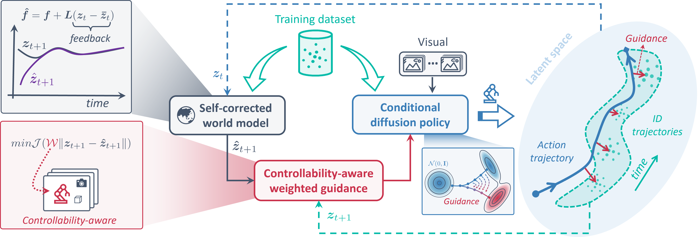
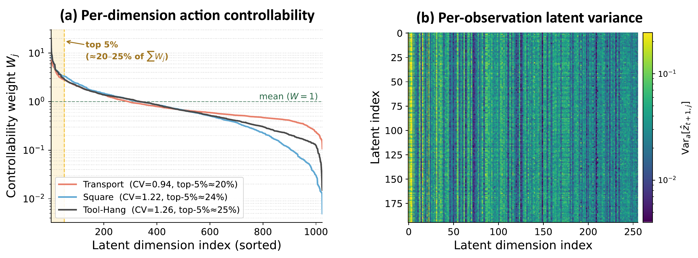
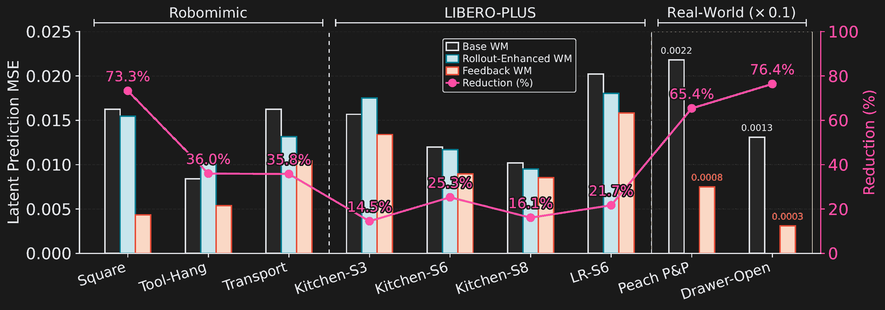
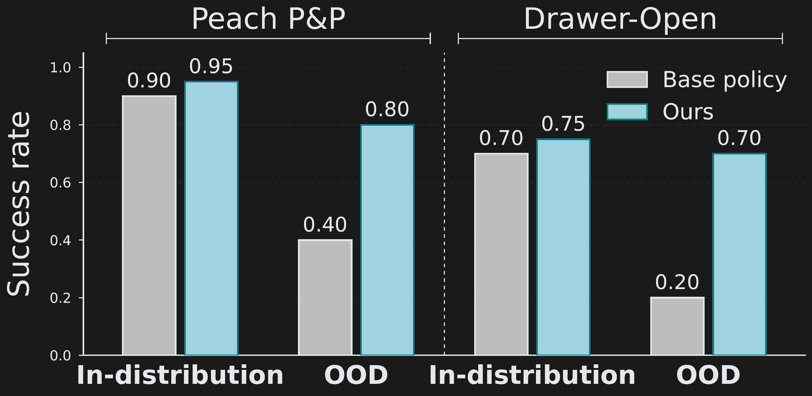
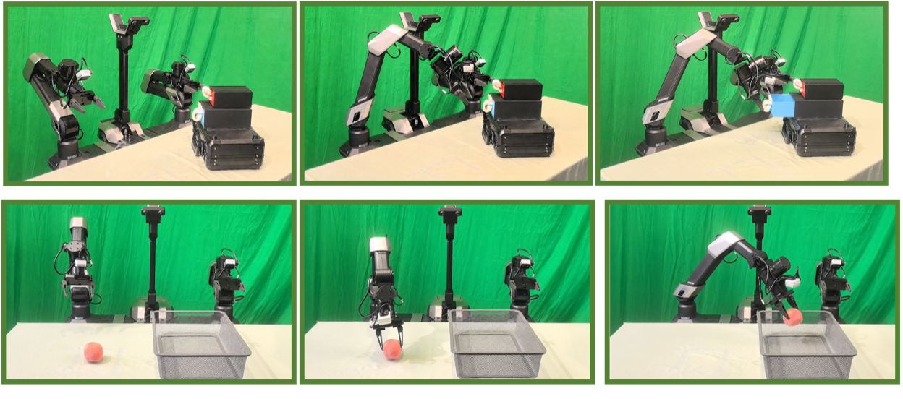
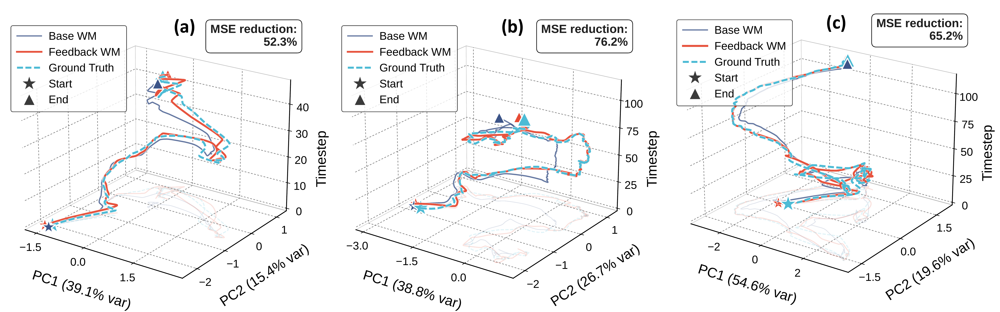

<h1 align="center">🔁 Feedback World Model Enables<br />Precise Guidance of Diffusion Policy</h1>

<p align="center">
  <a href="https://arxiv.org/abs/2605.15705"></a>
  <a href="https://arxiv.org/pdf/2605.15705"></a>
  <a href="https://lorenzo-0-0.github.io/Feedback_World_Model/"></a>
  <a href="https://github.com/Lorenzo-0-0/Feedback_World_Model"></a>
  
</p>

<p align="center">
  <a href="https://morpheus-an.github.io/"><strong>Tuo An</strong></a><sup>1,*</sup> &nbsp;&nbsp;
  <a href="https://jiajindou.github.io/"><strong>Jindou Jia</strong></a><sup>1,*</sup> &nbsp;&nbsp;
  <a href="https://reagan1311.github.io/"><strong>Gen Li</strong></a><sup>1</sup> &nbsp;&nbsp;
  <strong>Jingliang Li</strong><sup>1</sup> &nbsp;&nbsp;
  <a href="https://chuhaozhou99.github.io/Chuhao-Zhou/"><strong>Chuhao Zhou</strong></a><sup>1</sup>
  <br />
  <strong>Pengfei Liu</strong><sup>1</sup> &nbsp;&nbsp;
  <strong>Bofan Lyu</strong><sup>1</sup> &nbsp;&nbsp;
  <strong>Jiaqi Bai</strong><sup>1</sup> &nbsp;&nbsp;
  <a href="https://scholar.google.com/citations?hl=en&user=KWXEabIAAAAJ&view_op=list_works&sortby=pubdate"><strong>Xinying Guo</strong></a><sup>1</sup> &nbsp;&nbsp;
  <a href="https://scholar.google.com/citations?user=SZg1xeoAAAAJ&hl=zh-CN"><strong>Geng Li</strong></a><sup>1</sup> &nbsp;&nbsp;
  <a href="https://marsyang.site/"><strong>Jianfei Yang</strong></a><sup>1,†</sup>
</p>

<p align="center">
  <sup>1</sup>MARS Lab, Nanyang Technological University, Singapore
</p>

<p align="center">
  <sup>*</sup>Equal contribution &nbsp;&nbsp;&middot;&nbsp;&nbsp; <sup>†</sup>Corresponding author
</p>

<p align="center">
  
</p>

<table align="center" width="90%">
  <tr>
    <td valign="top">
      <b>Abstract.</b> World models aim to improve robotic decision making by predicting the consequences of actions. However, in practice, their predictions often become unreliable once the robot encounters states outside the training distribution, limiting their effectiveness at deployment. We observe that execution itself provides a natural but underutilized signal: after each action, the robot directly observes the true next state, revealing the mismatch between predicted and actual outcomes. Building on this insight, we propose the <b>feedback world model</b>, a new paradigm that closes the loop between prediction and observation at inference time. Instead of treating the world model as a static open-loop predictor, our method maintains a lightweight feedback state that is updated online to iteratively correct future predictions, compensating for model errors using real-time observations <b>without additional training data or parameter updates</b>. We show that this process can be interpreted as a <b>latent-space observer</b> and admits convergence guarantees under mild conditions. We further introduce <b>action-aware guidance</b> to better translate corrected predictions into control by emphasizing action-controllable components while suppressing irrelevant variations. Experiments on LIBERO-Plus, Robomimic, and real-world manipulation tasks demonstrate that our method substantially improves both prediction accuracy and policy performance under distribution shift. In particular, it reduces world model prediction error by up to <b>76.4%</b> and improves out-of-distribution (OOD) success rate by <b>30%</b>.
      <br /><br />
      
      <b>Correspondence:</b> Jianfei Yang &lt;<a href="mailto:jianfei.yang@ntu.edu.sg">jianfei.yang@ntu.edu.sg</a>&gt;
    </td>
  </tr>
</table>

---

## ✨ Highlights

- **🔁 Feedback world model.** Turn each executed action into a free correction signal — the gap between predicted and observed transitions is fed back online to keep the world model honest, with *no extra training data and no parameter updates*.
- **🧮 A latent-space observer.** The online update reads as a control-theoretic observer and admits convergence guarantees under a linear feedback formulation.
- **🎯 Action-aware guidance.** Concentrate guidance on latent dimensions the robot can actually move (end-effector motion, object pose, contact), suppressing action-irrelevant variation (background, lighting, texture).
- **📉 −76.4%** world-model prediction error &nbsp;·&nbsp; **📈 +30%** OOD success rate.
- **🧪 Broadly validated** on **LIBERO-Plus**, **Robomimic**, and **real-world** manipulation under out-of-distribution initial poses.

---

## ⚙️ Method — Closing the Loop at Inference Time

<p align="center">
  
</p>

**Overview of the Feedback-Guided Policy.** During denoising, the feedback world model predicts the latent outcome of the current action trajectory, and an action-aware energy steers the policy toward expert-like, action-relevant states. After each executed action, the new observation updates the feedback state, which corrects subsequent predictions and forms an outer loop that suppresses prediction drift at inference time.

> **Insight.** Deployment is *already* producing a free supervision signal: every executed action surfaces the gap between what was predicted and what actually happened. We close that loop online, turning a fixed open-loop predictor into an observer that self-corrects.

---

## 🎯 Action-Aware Guidance

<p align="center">
  
</p>

Action-aware guidance weights latent dimensions by how strongly each responds to the candidate action, and downweights what the robot cannot move. Per-dimension *action controllability* is estimated once, offline, from expert rollouts; at inference it concentrates the gradient on directions the policy can actually influence.

---

## 📊 Quantitative Results

<p align="center">
  
</p>

<p align="center"><sub>Latent prediction MSE under OOD perturbations across Robomimic, LIBERO-Plus, and real-world tasks. Feedback correction lowers error on every task — by up to <b>76.4%</b>.</sub></p>

<p align="center">
  
</p>

<p align="center"><sub>Real-world OOD success rate. Feedback correction + action-aware guidance yields the largest gains over the base diffusion policy.</sub></p>

---

## 🤖 Real-World Deployment

<p align="center">
  
</p>

<p align="center"><sub>Peach pick-and-place and drawer-open on a physical arm. The baseline drifts as soon as the initial pose moves out of distribution; our closed-loop policy stays on task and the OOD success rate roughly doubles. See more rollouts on the <a href="https://lorenzo-0-0.github.io/Feedback_World_Model/">project page</a>.</sub></p>

---

## 🧭 Latent-Space Trajectories

<p align="center">
  
</p>

<p align="center"><sub>Predicted and observed states projected into the world-model latent space. Without correction, the predicted trajectory peels away from the expert manifold; with feedback, it is pulled back in over time.</sub></p>

---

## 📌 Citation

If you find our work useful, please consider citing:

```bibtex
@misc{an2026feedback,
  title         = {Feedback World Model Enables Precise Guidance of Diffusion Policy},
  author        = {An, Tuo and Jia, Jindou and Li, Gen and Li, Jingliang and
                   Zhou, Chuhao and Liu, Pengfei and Lyu, Bofan and Bai, Jiaqi and
                   Guo, Xinying and Li, Geng and Yang, Jianfei},
  year          = {2026},
  eprint        = {2605.15705},
  archivePrefix = {arXiv},
  primaryClass  = {cs.RO}
}
```

---

<p align="center">
  🌐 <b>Project page:</b> <a href="https://lorenzo-0-0.github.io/Feedback_World_Model/">lorenzo-0-0.github.io/Feedback_World_Model</a>
  &nbsp;·&nbsp; 📄 <a href="https://arxiv.org/abs/2605.15705">arXiv:2605.15705</a>
  <br /><br />
  <sub>Project page built on the <a href="https://github.com/eliahuhorwitz/Academic-project-page-template">Academic Project Page Template</a>, with visual cues from <a href="https://github.com/yenchenlin/nerf-pytorch">Nerfies</a> &amp; Much Ado About Noising. Licensed under <a href="http://creativecommons.org/licenses/by-sa/4.0/">CC BY-SA 4.0</a>.</sub>
</p>
